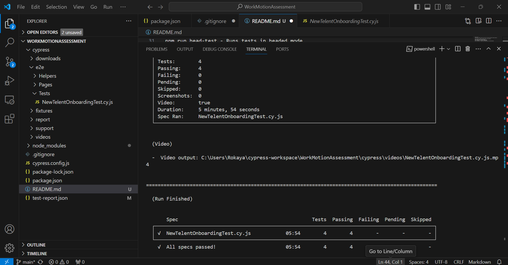
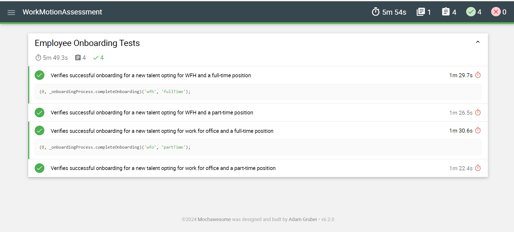

# Workmotion Assessment - Cypress Testing

## Features 💡

- **Atomic and Independent test cases**
- **Robust Locator strategies** to target elements
- **Implementing Page Object Model**
- **Hooks** to perform the repeated steps for all the tests inside spec
- **Loading test data** from external fixtures files i.e. JSON
- **Code Documentation**
- **Pass browser and mode** as environment variable
- **Configure routes** (URL endpoints) in a constant config file
- **Test Retries** for failing tests
- **Reusable test utilities functions** inside in `cypress/support/commands.js`
- **Custom commands** for login inside `cypress/e2e/utils`
- **Support for Cypress Cloud** (Dashboard)
- **Multiple reporters configuration** (`cypress-mochawesome-reporter` HTML)

## Setup

To set up the project for testing, ensure you have Node.js and npm installed. Then, follow these steps:

1. Clone the repository to your local machine.
2. Navigate to the project directory in your terminal.
3. Run `npm install` to install the required dependencies.

## Running Tests

This project includes several npm scripts to facilitate different testing scenarios:

- `npm run pretest` - Cleans up previous reports and screenshots.
- `npm run test` - Runs the full test suite.
- `npm run cypress-test` - Executes Cypress tests.
- `npm run head-test` - Runs tests in headed mode.
- `npm run chrome-test` - Executes tests specifically in the Chrome browser.
- `npm run recordDashBoardTest` - Records test runs # Workmotion Assessment - Cypress Testing

## Custom Commands

Custom commands enhance testing capabilities. For instance:

- `cy.setDate(day, monthNumber, year)` - Sets a date on a date picker component.
- `cy.generateUniqueEmail(baseEmail)` - Generates a unique email for testing purposes.

## Environment and Authentication

Tests are configured to run against the base URL `https://beta.workmotion.com/login`. Authentication details are specified in the `cypress.config.js` file, using environment variables for the username and password.

## Reporting

Test execution results are available in the `cypress/report` directory. The mochawesome reporter generates a JSON report, which can then be merged into a comprehensive HTML report for easy viewing.
and generates reports using the mochawesome reporter.
- `npm run posttest` - Merges reports and generates a comprehensive HTML report.

## Custom Commands

Custom commands enhance testing capabilities. For instance:

- `cy.setDate(day, monthNumber, year)` - Sets a date on a date picker component.
- `cy.generateUniqueEmail(baseEmail)` - Generates a unique email for testing purposes.

## Environment and Authentication

Tests are configured to run against the base URL `https://beta.workmotion.com/login`. Authentication details are specified in the `cypress.config.js` file, using environment variables for the username and password.

## Reporting

Test execution results are available in the `cypress/report` directory. The mochawesome reporter generates a JSON report, which can then be merged into a comprehensive HTML report for easy viewing.

